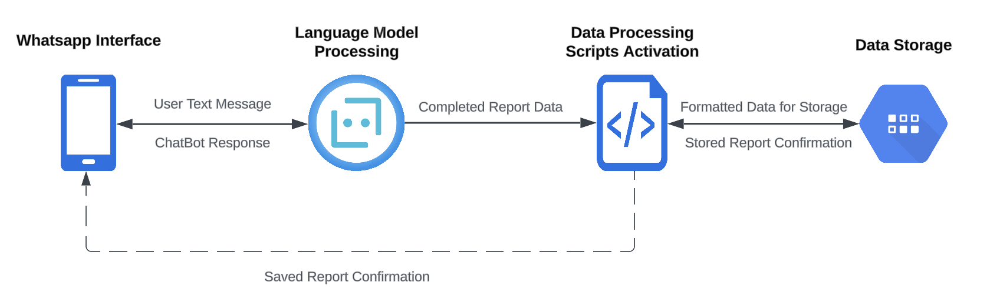

# Architecture Overview

The Emission Reporting Chabot System architecture capitalizes on the synergies between the WhatsApp Business API for seamless data collection, the innovative capabilities of the ChatGPT API/Lanchain for advanced natural language processing, and robust Azure cloud services for scalable hosting and deployment. Enhanced by an automated CI/CD pipeline using GitHub Actions, this system ensures efficient, secure, and reliable application updates and management.

## Components

1. **WhatsApp Interface (WhatsApp Business API)**: Serves as the pivotal interaction layer with users, streamlining the collection of emission data through intuitive text messaging. This component is significantly augmented by the integration with the Vonage API, which acts as a robust intermediary, facilitating seamless communication between the WhatsApp Business API and our system. The Vonage API ensures high reliability and global reach in messaging capabilities, enabling real-time, efficient data collection from users across diverse networks. This integration allows for the leveraging of advanced messaging features, such as message templates for quick replies or automated responses, enhancing user engagement and streamlining the data collection process.

2. **Language Model (ChatGPT API)**: Harnesses the power of natural language understanding to interpret conversational inputs from users, structuring them into standardized formats suitable for further processing. This component is instrumental in transforming raw text into structured, actionable data.

3. **Data Processing Scripts (Serverless Functions)**: Positioned within the Azure environment, these scalable serverless functions are activated upon receiving structured data from the ChatGPT API. They are responsible for final data validations and formatting, ensuring the data is primed for storage and analysis.

4. **CI/CD Pipeline (GitHub Actions & Azure App Service)**: Automates the deployment workflow, encompassing environment setup, dependency management, test execution (unit and integration), and secure deployment to Azure App Service. This pipeline embodies the principles of continuous integration and continuous deployment, facilitating rapid, reliable, and repeatable application updates.

## Data Flow

1. **User Interaction**: Initiated through the WhatsApp interface, users send data, starting the interaction process.
   
2. **Language Model Processing**: The Lnguage Model API receives user data, conducts initial processing, and performs validations, ensuring the data is correctly interpreted and structured.
   
3. **Data Processing Scripts Activation**: These Azure-based serverless functions are triggered following the initial conversation processing, taking charge of final data formatting and preparation for storage, completing the data handling cycle.

## Key Points

- **Scalability and Flexibility**: The architecture is designed for scalability, leveraging Azure's cloud infrastructure to handle varying loads efficiently. Serverless functions offer flexibility, allowing for cost-effective scaling.

- **Security and Reliability**: With Azure's secure hosting environment and GitHub Actions' encrypted secrets for CI/CD, the system ensures high security and reliability. Automated testing within the deployment pipeline further guarantees the stability of application releases.

- **Automated Deployment**: The CI/CD pipeline automates the entire deployment process, from testing to production rollout, minimizing manual interventions and speeding up the delivery of new features and updates.

- **Interoperability and Integration**: The system's components are chosen for their interoperability and ease of integration, facilitating a seamless flow of data across different services and platforms, enhancing the overall efficiency and effectiveness of the architecture.

# Final Note
The Emission Reporting Chatbot System melds the WhatsApp Business API with Vonage's messaging capabilities, natural language processing (ChatGPT, Llama2 and Custom implementation), and Azure's scalable cloud services, creating a robust platform for environmental data collection. Enhanced by an automated CI/CD pipeline through GitHub Actions and Azure App Service, the system exemplifies innovation in digital engagement and data processing. Designed for adaptability and expansion, it aims to evolve with technological advancements, ensuring its long-term relevance and impact on environmental conservation efforts.